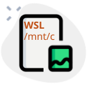

<p align="center">
  
</p>

<h1 align="center">Image Paste Win2WSL</h1>

<p align="center">
  <strong>Seamless Windows clipboard image sharing for WSL terminals & LLM coding agents</strong>
</p>

<p align="center">
  <a href="https://github.com/solla-h/image-paste-win2wsl/releases"></a>
  <a href="https://github.com/solla-h/image-paste-win2wsl/blob/main/LICENSE"></a>
  <a href="https://github.com/solla-h/image-paste-win2wsl/actions"></a>
</p>

<p align="center">
  <a href="#features">Features</a> •
  <a href="#quick-start">Quick Start</a> •
  <a href="#how-it-works">How It Works</a> •
  <a href="#documentation">Documentation</a> •
  <a href="#contributing">Contributing</a>
</p>

<p align="center">
  <b>Language:</b> English | <a href="README_zh-CN.md">中文</a>
</p>

---

## The Problem

Using AI coding agents (Claude Code, Codex CLI, Kiro CLI) inside WSL2? You've likely hit these walls:

| Pain Point | Impact |
|------------|--------|
| **No clipboard access** | WSL terminals cannot read Windows clipboard images |
| **High token consumption** | Large screenshots consume significant tokens when passed to Vision LLMs |
| **Workflow friction** | Manual save → upload → paste path is tedious |

## The Solution

**One hotkey. Zero friction.**

Press `Alt+V` anywhere, and Image Paste Win2WSL:

1. 📋 **Grabs** the clipboard image from Windows
2. 🗜️ **Optimizes** image dimensions for LLM consumption (Smart Scale)
3. 📂 **Saves** to local storage asynchronously
4. 📝 **Pastes** the WSL-compatible path (`/mnt/c/...`) instantly

---

## Features

| Feature | Description |
|---------|-------------|
| ⚡ **Instant Path Output** | Path appears in ~100ms; image saves in background |
| 🧠 **Smart Scale Plugin** | Auto-resizes large images to reduce token usage |
| 🔤 **IME Protection** | Auto-switches to English keyboard to avoid garbled paths |
| 🧹 **Auto Cleanup** | Removes cached images older than 2 hours |
| 🖥️ **System Tray** | Minimal UI with quick access to cache folder |
| 🔧 **Zero Dependencies** | Single `.exe` + PowerShell scripts, no installation required |

---

## Quick Start

### Download & Run

1. **Download** the latest release from [Releases](https://github.com/solla-h/image-paste-win2wsl/releases)
2. **Extract** the ZIP to any folder (e.g., `C:\Tools\ImagePasteWin2WSL`)
3. **Run** `image-paster-win2wsl.exe` — it minimizes to the system tray
4. **Use** `Alt+V` in any text field to paste an image path

> [!TIP]
> Add `image-paster-win2wsl.exe` to Windows Startup for automatic launch.

### From Source

```bash
git clone https://github.com/solla-h/image-paste-win2wsl.git
cd image-paste-win2wsl
```

**Option A: Run script directly** (requires [AutoHotkey v2](https://www.autohotkey.com/download/ahk-v2.exe) installed)
- Double-click `image-paster-win2wsl.ahk` to run

**Option B: Compile to `.exe`** (for distribution or startup)
1. Install [AutoHotkey v2](https://www.autohotkey.com/download/ahk-v2.exe)
2. Right-click `image-paster-win2wsl.ahk` → "Compile Script"
3. Run the generated `image-paster-win2wsl.exe`

> [!NOTE]
> Pre-compiled releases are available on the [Releases](https://github.com/solla-h/image-paste-win2wsl/releases) page.

---

## Requirements

| Requirement | Details |
|-------------|---------|
| **OS** | Windows 10/11 with WSL2 enabled |
| **PowerShell** | 5.1+ with script execution allowed |
| **AutoHotkey** | Only needed if compiling from source |

**Enable script execution** (one-time setup):
```powershell
Set-ExecutionPolicy RemoteSigned -Scope CurrentUser
```

---

## How It Works

```
┌────────────────────────────────────────────────────────────────┐
│                     Alt+V Hotkey Triggered                     │
├────────────────────────────────────────────────────────────────┤
│  1. Save current keyboard layout                               │
│  2. Switch to English (US) layout                              │
│  3. Generate timestamped filename → 20260112_172400_123.png    │
│  4. Convert to WSL path → /mnt/c/.../temp/20260112_172400_123.png  │
│  5. Paste path immediately (instant feedback)                  │
│  6. Async: PowerShell saves image + SmartScale optimization    │
│  7. Restore original keyboard layout                           │
└────────────────────────────────────────────────────────────────┘
```

### Project Structure

```
image-paste-win2wsl/
├── image-paster-win2wsl.ahk   # Main AutoHotkey script
├── image-paster-win2wsl.exe   # Compiled executable
├── lib/
│   ├── save-clipboard-image.ps1   # Clipboard → PNG saver
│   ├── SmartScale.ps1             # LLM-optimized image scaling
│   └── exit-all.ps1               # Cleanup script
├── temp/                          # Image cache (auto-cleaned)
├── icon/                          # Application icons
└── docs/                          # Technical documentation
```

---

## Smart Scale Plugin

The Smart Scale plugin automatically resizes large images before saving. This helps reduce token consumption when images are processed by Vision LLMs.

### Why 1568px?

The plugin uses **1568 pixels** as the maximum long-edge threshold. This value is based on official recommendations from major LLM providers:

| Provider | Model | Official Guidance | Source |
|----------|-------|-------------------|--------|
| **Anthropic** | Claude 4 Sonnet | "If your image's long edge is more than 1568 pixels... it will first be scaled down" | [Claude Vision Docs](https://platform.claude.com/docs/en/build-with-claude/vision) |
| **OpenAI** | GPT-4o | Images are tiled into 512x512 chunks; larger images = more tiles = more tokens | [OpenAI Vision Guide](https://platform.openai.com/docs/guides/images-vision) |
| **Google** | Gemini 3 | `MEDIA_RESOLUTION_HIGH` recommended; larger images are processed with more tiles | [Gemini Media Resolution](https://ai.google.dev/gemini-api/docs/media-resolution) |

### How It Works

1. Images with long edge ≤ 1568px pass through unchanged
2. Larger images are scaled down proportionally using high-quality bicubic interpolation
3. No external dependencies — uses native .NET GDI+ graphics

### Token Calculation References

For exact token calculations, refer to official documentation:

- **Claude**: `tokens = (width × height) / 750` — [Calculate image costs](https://platform.claude.com/docs/en/build-with-claude/vision#calculate-image-costs)
- **GPT-4o**: `85 + 170 × (number of 512px tiles)` — [Vision pricing](https://platform.openai.com/docs/guides/images-vision)
- **Gemini 3**: Token count varies by `media_resolution` setting — [Token counts](https://ai.google.dev/gemini-api/docs/tokens)

---

## Documentation

| Document | Description |
|----------|-------------|
| [Architecture & Flow](docs/architecture.md) | Technical deep-dive into component design |
| [Terminal Ctrl+V Analysis](docs/terminal-ctrl-v-interception.md) | Why terminals intercept Ctrl+V and our workaround |

---

## Customization

### Change Hotkey

Edit `image-paster-win2wsl.ahk` line 23:

```ahk
; Current: Alt+V
!v:: {

; Examples:
; ^!v::     → Ctrl+Alt+V
; ^+v::     → Ctrl+Shift+V
; #v::      → Win+V
```

Then recompile (see [Building from Source](#building-from-source)).

### Change Temp Directory

Edit line 6 in `image-paster-win2wsl.ahk`:

```ahk
global gTempDir := gScriptDir "\temp"  ; Modify path here
```

### Adjust Cleanup Interval

Edit line 127 in `image-paster-win2wsl.ahk`:

```ahk
SetTimer(CleanupTempFolder, 2 * 60 * 60 * 1000)  ; Default: 2 hours
```

---

## Building from Source

### Prerequisites

1. Install [AutoHotkey v2](https://www.autohotkey.com/download/ahk-v2.exe)
2. Download [Ahk2Exe compiler](https://github.com/AutoHotkey/Ahk2Exe/releases)

### Compile

```powershell
# Using Ahk2Exe GUI
# Source: image-paster-win2wsl.ahk
# Destination: image-paster-win2wsl.exe
# Icon: icon\image-paste-icon_256.ico
# Base: AutoHotkey64.exe
```

Or use the automated CI/CD pipeline by pushing a version tag:

```bash
git tag v2.2.0
git push origin v2.2.0
```

GitHub Actions will automatically build and create a release.

---

## Security Notice

> [!NOTE]
> Some antivirus software may flag AutoHotkey executables as false positives.
> This is a [known issue](https://www.autohotkey.com/docs/v2/FAQ.htm#Virus) in the AutoHotkey community.
> 
> **All source code is open and auditable.** Review the `.ahk` and `.ps1` files to verify.

---

## Contributing

Contributions are welcome! Please:

1. Fork the repository
2. Create a feature branch (`git checkout -b feature/amazing-feature`)
3. Commit your changes (`git commit -m 'Add amazing feature'`)
4. Push to the branch (`git push origin feature/amazing-feature`)
5. Open a Pull Request

---

## Changelog

### v2.1 (Current)
- ✨ **Smart Scale Plugin**: Auto-resize images for LLM Vision APIs
- 🚀 **GitHub Actions CI/CD**: Automated builds and releases
- 📁 **Flattened structure**: Simplified project layout

### v2.0
- ⚡ **Path-first architecture**: Instant path paste, async image save
- 🔤 **IME protection**: Reliable English-only path output
- 🧹 **Auto cleanup**: Periodic cache purging

### v1.0
- 📋 Basic clipboard sync with SHA256 deduplication

---

## Acknowledgments

This project is a hard fork of [cpulxb/WSL-Image-Clipboard-Helper](https://github.com/cpulxb/WSL-Image-Clipboard-Helper). While the original provided the foundational concept, this fork focuses on **performance optimization**, **LLM compatibility**, and **automated maintenance**.

---

## License

[MIT License](LICENSE) © 2026 solla-h

---

<p align="center">
  Made with ❤️ for WSL developers
</p>
